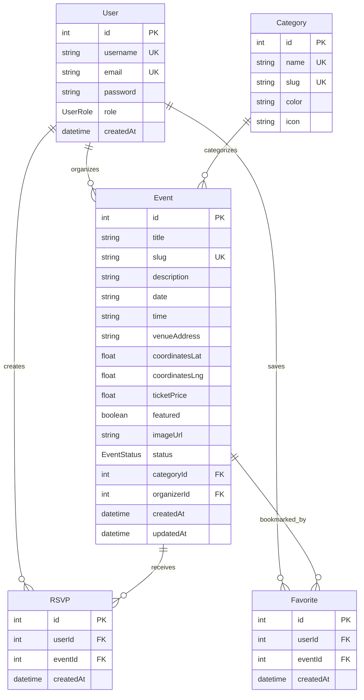

# Technical Design Document: Unified Next.js App

## Overview

### Purpose

This document specifies the technical design for migrating the existing two-project architecture (Strapi backend + Next.js frontend) into a single, self-contained Next.js application. The unified application will replace Strapi with Next.js API routes, implement Prisma ORM with SQLite for local development and PostgreSQL for production, and maintain all existing frontend functionality while simplifying the development and deployment workflow.

### Goals

1. **Single Command Development**: Enable developers to run the entire application with one `npm run dev` command
2. **Simplified Architecture**: Eliminate the need for separate backend and frontend projects
3. **Type Safety**: Leverage Prisma's type-safe database client across the entire stack
4. **Backward Compatibility**: Preserve all existing frontend features and user-facing functionality
5. **Optional Caching**: Implement Redis caching with graceful degradation when unavailable
6. **Production Ready**: Support both SQLite (development) and PostgreSQL (production) databases

### Scope

**In Scope:**
- Migration of all Strapi content types (Events, Categories, RSVPs, Users) to Prisma schema
- Implementation of Next.js API routes to replace Strapi REST endpoints
- NextAuth-based authentication system with JWT sessions
- All existing frontend pages and components (Home, Events, Dashboard, etc.)
- Responsive design for mobile and desktop viewports
- Optional Redis caching layer
- Database seeding for development

**Out of Scope:**
- Strapi admin panel replacement (content management will be through API/code)
- File upload infrastructure (images assumed to be hosted on Cloudinary)
- Real-time features (websockets, subscriptions)
- Advanced search with full-text indexing
- Email notification system
- Payment processing integration

### Key Changes from Current Architecture

| Aspect | Current (Strapi + Next.js) | New (Unified Next.js) |
|--------|---------------------------|----------------------|
| **Project Structure** | Two separate projects | Single Next.js project |
| **Backend** | Strapi CMS on port 1337 | Next.js API routes |
| **Database** | External PostgreSQL | Prisma (SQLite dev, PostgreSQL prod) |
| **Authentication** | Strapi users-permissions | NextAuth with Credentials provider |
| **ORM** | Strapi's entity service | Prisma Client |
| **API Format** | Strapi v5 format with `documentId` | Custom JSON format |
| **Development** | Two terminals, two ports | One command, one port |
| **Type Safety** | Manual type definitions | Auto-generated Prisma types |

## Architecture

### System Architecture

The unified application follows a monolithic architecture with clear separation between presentation, API, and data layers:

```
┌─────────────────────────────────────────────────────────────┐
│                     Next.js Application                      │
│                                                               │
│  ┌────────────────────────────────────────────────────────┐ │
│  │              Presentation Layer (RSC/Client)           │ │
│  │  • Server Components (SSR, data fetching)              │ │
│  │  • Client Components (interactivity, maps)             │ │
│  │  • Route handlers (/app/api/*)                         │ │
│  └───────────┬────────────────────────────────────────────┘ │
│              │                                                │
│  ┌───────────▼────────────────────────────────────────────┐ │
│  │                  API Layer                             │ │
│  │  • Authentication (NextAuth)                           │ │
│  │  • Events API (/api/events)                            │ │
│  │  • Categories API (/api/categories)                    │ │
│  │  • RSVPs API (/api/rsvps)                              │ │
│  │  • Favorites API (/api/favorites)                      │ │
│  └───────────┬────────────────────────────────────────────┘ │
│              │                                                │
│  ┌───────────▼────────────────────────────────────────────┐ │
│  │              Data Access Layer                         │ │
│  │  • Prisma Client (type-safe queries)                   │ │
│  │  • Redis Cache (optional, graceful degradation)        │ │
│  └───────────┬────────────────────────────────────────────┘ │
│              │                                                │
└──────────────┼────────────────────────────────────────────────┘
               │
    ┌──────────▼──────────┐         ┌──────────────┐
    │  SQLite (dev) /     │         │    Redis     │
    │  PostgreSQL (prod)  │         │  (optional)  │
    └─────────────────────┘         └──────────────┘
```

### Directory Structure

The unified application uses the Next.js App Router structure with the existing `frontend/` directory as the project root:

```
frontend/                          # Project root
├── prisma/
│   ├── schema.prisma             # Database schema definition
│   ├── migrations/               # Database migration files
│   └── seed.ts                   # Database seeding script
├── src/
│   ├── app/                      # Next.js App Router
│   │   ├── api/                  # API routes
│   │   │   ├── auth/
│   │   │   │   ├── [...nextauth]/route.ts
│   │   │   │   └── register/route.ts
│   │   │   ├── events/
│   │   │   │   ├── route.ts      # GET /api/events, POST /api/events
│   │   │   │   └── [slug]/
│   │   │   │       ├── route.ts  # GET /api/events/:slug, PUT, DELETE
│   │   │   │       └── publish/route.ts
│   │   │   ├── categories/
│   │   │   │   ├── route.ts
│   │   │   │   └── [slug]/route.ts
│   │   │   ├── rsvps/
│   │   │   │   ├── route.ts
│   │   │   │   ├── my/route.ts
│   │   │   │   └── [id]/route.ts
│   │   │   └── favorites/
│   │   │       ├── route.ts
│   │   │       ├── my/route.ts
│   │   │       └── [id]/route.ts
│   │   ├── auth/
│   │   │   ├── signin/page.tsx
│   │   │   └── signup/page.tsx
│   │   ├── events/
│   │   │   ├── page.tsx          # Events discovery page
│   │   │   └── [slug]/page.tsx   # Event detail page
│   │   ├── dashboard/
│   │   │   ├── layout.tsx
│   │   │   ├── page.tsx          # My RSVPs
│   │   │   ├── favorites/page.tsx
│   │   │   ├── create-event/page.tsx
│   │   │   └── profile/page.tsx
│   │   ├── about/page.tsx
│   │   ├── contact/page.tsx
│   │   ├── page.tsx              # Home page
│   │   └── layout.tsx            # Root layout
│   ├── components/               # React components
│   │   ├── events/
│   │   ├── layout/
│   │   ├── ui/
│   │   └── providers/
│   ├── lib/
│   │   ├── prisma.ts             # Prisma client singleton
│   │   ├── auth.ts               # NextAuth configuration
│   │   ├── redis.ts              # Redis client (optional)
│   │   ├── api.ts                # API helper functions
│   │   └── utils.ts              # Utility functions
│   └── types/
│       └── index.ts              # TypeScript type definitions
├── .env.local                    # Environment variables
├── package.json
├── tsconfig.json
└── next.config.ts
```

### Technology Stack

| Layer | Technology | Version | Purpose |
|-------|-----------|---------|---------|
| **Framework** | Next.js | 16.2.4 | Full-stack React framework with App Router |
| **Runtime** | Node.js | ≥18.x | JavaScript runtime |
| **Language** | TypeScript | ^5.x | Type-safe development |
| **Database (Dev)** | SQLite | 3.x | Embedded database for local development |
| **Database (Prod)** | PostgreSQL | ≥14.x | Production relational database |
| **ORM** | Prisma | ^6.x | Type-safe database client |
| **Authentication** | NextAuth.js | ^4.24.14 | Session and authentication management |
| **Password Hashing** | bcryptjs | ^2.4.3 | Secure password hashing |
| **Caching** | Upstash Redis | ^1.37.0 | Optional in-memory cache |
| **Maps** | Leaflet + React Leaflet | ^5.0.0 | Interactive map components |
| **UI Components** | shadcn/ui | Latest | Pre-built accessible components |
| **Styling** | Tailwind CSS | ^4.x | Utility-first CSS framework |
| **Icons** | Lucide React | ^1.14.0 | Icon library |
| **Animation** | Framer Motion | ^12.38.0 | Animation library |

### Deployment Architecture

**Development Environment:**
- Single Next.js dev server on port 3000
- SQLite database file (`dev.db`) in `prisma/` directory
- Optional Redis connection to Upstash (graceful degradation if absent)
- Hot reload for both frontend and API changes

**Production Environment:**
- Next.js app deployed to Vercel, Netlify, or similar platform
- PostgreSQL database (managed service: Vercel Postgres, Supabase, AWS RDS)
- Upstash Redis for caching (optional but recommended)
- Environment variables configured in platform dashboard

## Components and Interfaces

### Database Schema (Prisma)

The Prisma schema defines all data models and their relationships:

```prisma
// prisma/schema.prisma

generator client {
  provider = "prisma-client-js"
}

datasource db {
  provider = "sqlite"  // Changed to "postgresql" in production
  url      = env("DATABASE_URL")
}

enum UserRole {
  GUEST
  USER
  ADMIN
}

enum EventStatus {
  DRAFT
  PUBLISHED
}

model User {
  id        Int       @id @default(autoincrement())
  username  String    @unique
  email     String    @unique
  password  String    // Hashed with bcryptjs
  role      UserRole  @default(USER)
  createdAt DateTime  @default(now())
  
  // Relations
  events    Event[]   @relation("UserEvents")
  rsvps     RSVP[]
  favorites Favorite[]
  
  @@map("users")
}

model Event {
  id             Int         @id @default(autoincrement())
  title          String
  slug           String      @unique
  description    String?     @db.Text
  date           String      // Stored as ISO date string (YYYY-MM-DD)
  time           String      // Stored as time string (HH:MM)
  venueAddress   String
  coordinatesLat Float?
  coordinatesLng Float?
  ticketPrice    Float       @default(0)
  featured       Boolean     @default(false)
  imageUrl       String?
  status         EventStatus @default(DRAFT)
  createdAt      DateTime    @default(now())
  updatedAt      DateTime    @updatedAt
  
  // Relations
  categoryId     Int?
  category       Category?   @relation(fields: [categoryId], references: [id], onDelete: SetNull)
  organizerId    Int?
  organizer      User?       @relation("UserEvents", fields: [organizerId], references: [id], onDelete: SetNull)
  rsvps          RSVP[]
  favorites      Favorite[]
  
  @@index([slug])
  @@index([status])
  @@index([featured])
  @@index([categoryId])
  @@map("events")
}

model Category {
  id     Int     @id @default(autoincrement())
  name   String  @unique
  slug   String  @unique
  color  String  @default("#000000")
  icon   String?
  
  // Relations
  events Event[]
  
  @@map("categories")
}

model RSVP {
  id        Int      @id @default(autoincrement())
  createdAt DateTime @default(now())
  
  // Relations
  userId    Int
  user      User     @relation(fields: [userId], references: [id], onDelete: Cascade)
  eventId   Int
  event     Event    @relation(fields: [eventId], references: [id], onDelete: Cascade)
  
  @@unique([userId, eventId])
  @@index([userId])
  @@index([eventId])
  @@map("rsvps")
}

model Favorite {
  id        Int      @id @default(autoincrement())
  createdAt DateTime @default(now())
  
  // Relations
  userId    Int
  user      User     @relation(fields: [userId], references: [id], onDelete: Cascade)
  eventId   Int
  event     Event    @relation(fields: [eventId], references: [id], onDelete: Cascade)
  
  @@unique([userId, eventId])
  @@index([userId])
  @@index([eventId])
  @@map("favorites")
}
```

**Key Design Decisions:**

1. **Integer IDs**: Using auto-incrementing integers instead of Strapi's `documentId` for simplicity
2. **Slug Uniqueness**: `slug` fields are unique to support URL routing
3. **Cascade Deletes**: RSVPs and Favorites are cascade-deleted when users or events are removed
4. **Nullable Relations**: Category and Organizer are optional (nullable foreign keys)
5. **Date/Time Storage**: Dates and times stored as strings for simplicity (no timezone complexity)
6. **Coordinates**: Stored as separate `lat` and `lng` float fields instead of JSON

### API Interfaces

All API routes return consistent JSON responses with the following structure:

**Success Response (Single Entity):**
```typescript
{
  data: {
    id: number;
    // ... entity fields
  }
}
```

**Success Response (Collection with Pagination):**
```typescript
{
  data: Array<Entity>;
  meta: {
    pagination: {
      page: number;
      pageSize: number;
      total: number;
      pageCount: number;
    }
  }
}
```

**Error Response:**
```typescript
{
  error: {
    status: number;
    message: string;
    details?: any;
  }
}
```

#### Events API

**GET /api/events**
- Query Parameters:
  - `search?: string` - Filter by title or venue address
  - `category?: string` - Filter by category slug
  - `page?: number` - Page number (default: 1)
  - `limit?: number` - Items per page (default: 12)
- Response: `{ data: Event[], meta: { pagination } }`
- Caching: Yes (Redis, 1 hour TTL)

**GET /api/events/[slug]**
- Response: `{ data: Event & { rsvpCount: number, userHasRSVPed?: boolean } }`
- Caching: Yes (Redis, 1 hour TTL)

**POST /api/events**
- Auth: Required (USER role)
- Body: `{ title, slug, description, date, time, venueAddress, coordinatesLat, coordinatesLng, ticketPrice, imageUrl, categoryId }`
- Response: `{ data: Event }`

**PUT /api/events/[slug]**
- Auth: Required (Owner or ADMIN)
- Body: Partial Event fields
- Response: `{ data: Event }`

**DELETE /api/events/[slug]**
- Auth: Required (Owner or ADMIN)
- Response: `{ data: { message: "Event deleted" } }`

**PATCH /api/events/[slug]/publish**
- Auth: Required (ADMIN role)
- Response: `{ data: Event }`

#### Categories API

**GET /api/categories**
- Response: `{ data: Category[] }`
- Caching: Yes (Redis, 1 hour TTL)

**POST /api/categories**
- Auth: Required (ADMIN)
- Body: `{ name, slug, color?, icon? }`
- Response: `{ data: Category }`

**PUT /api/categories/[slug]**
- Auth: Required (ADMIN)
- Body: Partial Category fields
- Response: `{ data: Category }`

**DELETE /api/categories/[slug]**
- Auth: Required (ADMIN)
- Response: `{ data: { message: "Category deleted" } }`

#### RSVPs API

**GET /api/rsvps/my**
- Auth: Required
- Response: `{ data: Array<RSVP & { event: Event }> }`

**POST /api/rsvps**
- Auth: Required
- Body: `{ eventId: number }`
- Response: `{ data: RSVP }`

**DELETE /api/rsvps/[id]**
- Auth: Required (Owner only)
- Response: `{ data: { message: "RSVP deleted" } }`

#### Favorites API

**GET /api/favorites/my**
- Auth: Required
- Response: `{ data: Array<Favorite & { event: Event }> }`

**POST /api/favorites**
- Auth: Required
- Body: `{ eventId: number }`
- Response: `{ data: Favorite }`

**DELETE /api/favorites/[id]**
- Auth: Required (Owner only)
- Response: `{ data: { message: "Favorite deleted" } }`

#### Authentication API

**POST /api/auth/register**
- Body: `{ username: string, email: string, password: string }`
- Response: `{ data: { id, username, email, role } }`

**POST /api/auth/[...nextauth]**
- Handled by NextAuth
- Providers: Credentials (email/password)

### Core Components

#### Prisma Client Singleton

```typescript
// src/lib/prisma.ts

import { PrismaClient } from '@prisma/client';

const globalForPrisma = globalThis as unknown as {
  prisma: PrismaClient | undefined;
};

export const prisma =
  globalForPrisma.prisma ??
  new PrismaClient({
    log: process.env.NODE_ENV === 'development' ? ['query', 'error', 'warn'] : ['error'],
  });

if (process.env.NODE_ENV !== 'production') {
  globalForPrisma.prisma = prisma;
}
```

**Purpose**: Prevents multiple Prisma Client instances in development (hot reload)

#### NextAuth Configuration

```typescript
// src/lib/auth.ts

import { NextAuthOptions } from 'next-auth';
import CredentialsProvider from 'next-auth/providers/credentials';
import bcrypt from 'bcryptjs';
import { prisma } from './prisma';

export const authOptions: NextAuthOptions = {
  providers: [
    CredentialsProvider({
      name: 'Credentials',
      credentials: {
        email: { label: "Email", type: "email" },
        password: { label: "Password", type: "password" }
      },
      async authorize(credentials) {
        if (!credentials?.email || !credentials?.password) {
          throw new Error('Email and password required');
        }

        const user = await prisma.user.findUnique({
          where: { email: credentials.email }
        });

        if (!user || !await bcrypt.compare(credentials.password, user.password)) {
          throw new Error('Invalid email or password');
        }

        return {
          id: user.id.toString(),
          email: user.email,
          name: user.username,
          role: user.role,
        };
      }
    })
  ],
  callbacks: {
    async jwt({ token, user }) {
      if (user) {
        token.id = user.id;
        token.role = user.role;
        token.username = user.name;
      }
      return token;
    },
    async session({ session, token }) {
      if (session.user) {
        session.user.id = token.id as string;
        session.user.role = token.role as string;
        session.user.username = token.username as string;
      }
      return session;
    }
  },
  pages: {
    signIn: '/auth/signin',
  },
  session: {
    strategy: 'jwt',
  },
  secret: process.env.NEXTAUTH_SECRET,
};
```

**JWT Payload**: `{ id, email, username, role }`

#### Redis Client (Graceful Degradation)

```typescript
// src/lib/redis.ts

import { Redis } from '@upstash/redis';

const url = process.env.UPSTASH_REDIS_REST_URL;
const token = process.env.UPSTASH_REDIS_REST_TOKEN;

let redisClient: Redis | null = null;

if (url && token) {
  redisClient = new Redis({ url, token });
} else {
  console.warn('⚠️  Redis credentials missing. Caching disabled.');
}

export const redis = {
  async get<T>(key: string): Promise<T | null> {
    if (!redisClient) return null;
    try {
      return await redisClient.get<T>(key);
    } catch (error) {
      console.error('Redis GET error:', error);
      return null;
    }
  },
  
  async set(key: string, value: any, options?: { ex?: number }): Promise<void> {
    if (!redisClient) return;
    try {
      await redisClient.set(key, value, options);
    } catch (error) {
      console.error('Redis SET error:', error);
    }
  },
  
  async del(key: string): Promise<void> {
    if (!redisClient) return;
    try {
      await redisClient.del(key);
    } catch (error) {
      console.error('Redis DEL error:', error);
    }
  }
};
```

**Design Principle**: All Redis operations return `null` or no-op when credentials are missing, allowing the app to function without caching.

#### API Helper Functions

```typescript
// src/lib/api.ts

import { redis } from './redis';
import { prisma } from './prisma';

const CACHE_TTL = 3600; // 1 hour

export async function fetchWithCache<T>(
  cacheKey: string,
  fetcher: () => Promise<T>
): Promise<T> {
  // Try cache first
  const cached = await redis.get<T>(cacheKey);
  if (cached) {
    return cached;
  }

  // Fetch from database
  const data = await fetcher();

  // Save to cache
  await redis.set(cacheKey, data, { ex: CACHE_TTL });

  return data;
}

export function createPaginationMeta(
  page: number,
  pageSize: number,
  total: number
) {
  return {
    pagination: {
      page,
      pageSize,
      total,
      pageCount: Math.ceil(total / pageSize),
    },
  };
}

export function generateSlug(title: string): string {
  return title
    .toLowerCase()
    .replace(/[^\w\s-]/g, '')
    .replace(/\s+/g, '-')
    .replace(/--+/g, '-')
    .trim();
}
```

### Frontend Components

Key React components remain largely unchanged but will now fetch from internal API routes instead of Strapi:

**Server Components** (SSR, data fetching):
- `app/page.tsx` - Home page with featured events
- `app/events/[slug]/page.tsx` - Event detail page
- `app/dashboard/page.tsx` - Dashboard RSVPs list

**Client Components** (interactivity):
- `components/events/event-map.tsx` - Leaflet map with markers
- `components/events/rsvp-button.tsx` - RSVP action button
- `components/events/event-card.tsx` - Event card with hover effects
- `components/layout/navbar.tsx` - Navigation with hamburger menu

## Data Models

### Type Definitions

TypeScript types will be auto-generated from Prisma schema and extended for API responses:

```typescript
// src/types/index.ts

import { User, Event, Category, RSVP, Favorite, UserRole, EventStatus } from '@prisma/client';

// Re-export Prisma types
export type { User, Event, Category, RSVP, Favorite, UserRole, EventStatus };

// Extended types for API responses
export type EventWithRelations = Event & {
  category: Category | null;
  rsvpCount: number;
  userHasRSVPed?: boolean;
};

export type RSVPWithEvent = RSVP & {
  event: Event & { category: Category | null };
};

export type FavoriteWithEvent = Favorite & {
  event: Event & { category: Category | null };
};

// API response types
export interface ApiResponse<T> {
  data: T;
}

export interface ApiCollectionResponse<T> {
  data: T[];
  meta: {
    pagination: {
      page: number;
      pageSize: number;
      total: number;
      pageCount: number;
    };
  };
}

export interface ApiError {
  error: {
    status: number;
    message: string;
    details?: any;
  };
}

// Session extension for NextAuth
declare module 'next-auth' {
  interface Session {
    user: {
      id: string;
      email: string;
      username: string;
      role: UserRole;
    };
  }

  interface User {
    id: string;
    email: string;
    name: string;
    role: UserRole;
  }
}

declare module 'next-auth/jwt' {
  interface JWT {
    id: string;
    email: string;
    username: string;
    role: UserRole;
  }
}
```

### Data Relationships



### Data Migration Strategy

**Phase 1: Schema Creation**
1. Define Prisma schema matching all Strapi content types
2. Run `npx prisma migrate dev --name init` to create initial migration
3. Generate Prisma Client: `npx prisma generate`

**Phase 2: Seed Data**
1. Create `prisma/seed.ts` with sample categories and events
2. Add seed script to `package.json`: `"prisma": { "seed": "tsx prisma/seed.ts" }`
3. Run `npx prisma db seed`

**Phase 3: Data Transfer (if migrating existing production data)**
1. Export data from Strapi database using custom script
2. Transform Strapi format to match Prisma schema
3. Import using Prisma Client batch operations
4. Verify data integrity

**Example Seed Script:**

```typescript
// prisma/seed.ts

import { PrismaClient, UserRole, EventStatus } from '@prisma/client';
import bcrypt from 'bcryptjs';

const prisma = new PrismaClient();

async function main() {
  console.log('🌱 Seeding database...');

  // Create admin user
  const admin = await prisma.user.create({
    data: {
      username: 'admin',
      email: 'admin@example.com',
      password: await bcrypt.hash('admin123', 10),
      role: UserRole.ADMIN,
    },
  });

  // Create categories
  const categories = await Promise.all([
    prisma.category.create({ data: { name: 'Music', slug: 'music', color: '#FF6B6B', icon: '🎵' } }),
    prisma.category.create({ data: { name: 'Technology', slug: 'technology', color: '#4ECDC4', icon: '💻' } }),
    prisma.category.create({ data: { name: 'Sports', slug: 'sports', color: '#95E1D3', icon: '⚽' } }),
    prisma.category.create({ data: { name: 'Food', slug: 'food', color: '#F38181', icon: '🍕' } }),
    prisma.category.create({ data: { name: 'Art', slug: 'art', color: '#AA96DA', icon: '🎨' } }),
  ]);

  // Create sample events
  await prisma.event.createMany({
    data: [
      {
        title: 'Summer Music Festival 2025',
        slug: 'summer-music-festival-2025',
        description: 'Join us for an unforgettable night of live music...',
        date: '2025-07-15',
        time: '18:00',
        venueAddress: 'Central Park, New York, NY',
        coordinatesLat: 40.785091,
        coordinatesLng: -73.968285,
        ticketPrice: 45.00,
        featured: true,
        imageUrl: 'https://images.unsplash.com/photo-1514320291840-2e0a9bf2a9ae',
        status: EventStatus.PUBLISHED,
        categoryId: categories[0].id,
        organizerId: admin.id,
      },
      // ... more events
    ],
  });

  console.log('✅ Seeding completed!');
}

main()
  .catch((e) => {
    console.error('❌ Seeding failed:', e);
    process.exit(1);
  })
  .finally(async () => {
    await prisma.$disconnect();
  });
```

