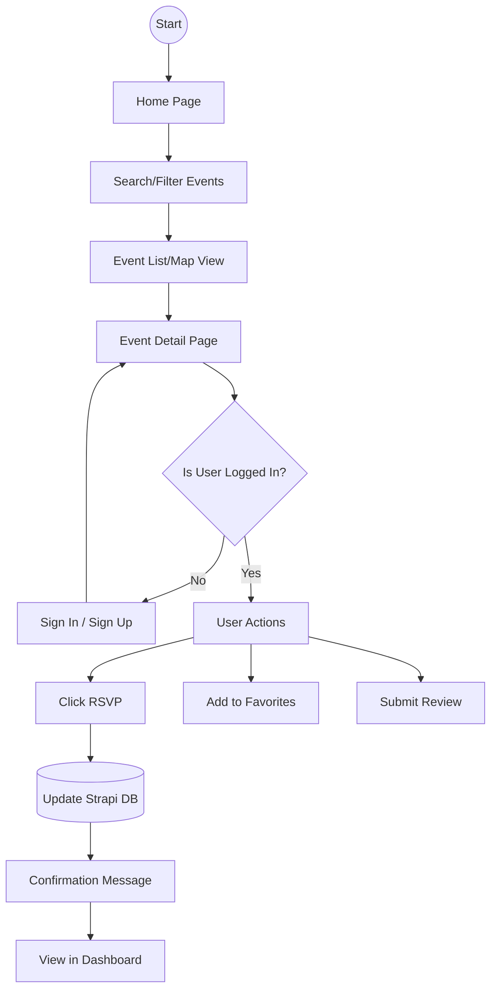
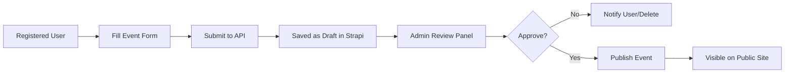
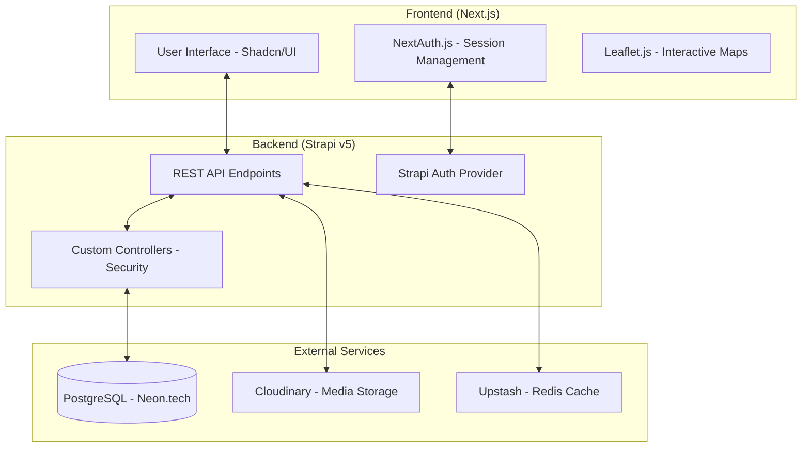
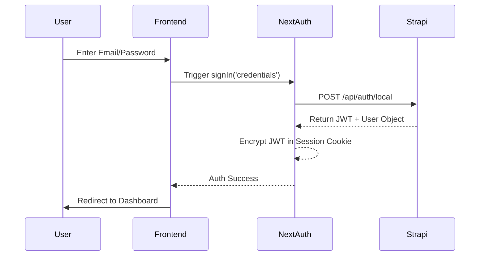

# Project Flowcharts

This document visualizes the core workflows and architecture of the **Event Discovery & Community Engagement Platform** using Mermaid diagrams.

---

## 1. User Journey Flow (Guest & Registered)

---

## 2. Event Submission & Approval Flow

---

## 3. System Architecture & Data Flow

---

## 4. Authentication Logic (NextAuth + Strapi)

---

> [!TIP]
> These flowcharts are useful for understanding the technical boundaries of the system and how different components interact in real-time.
